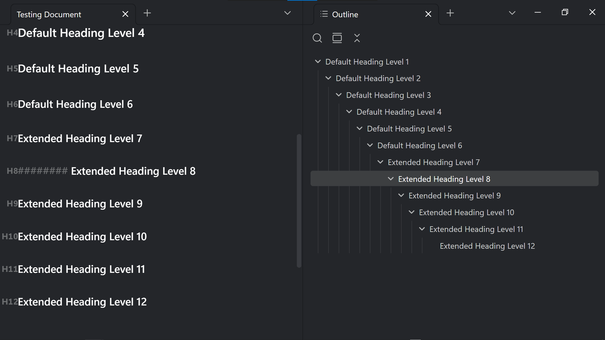

# Extended Headings

Extended Headings extends Obsidian's ATX heading workflow from H1–H6 through H12. It adds editing, styling, folding, outlines, heading navigation, heading-level markers, heading shifting, and block-or-heading reference commands while leaving note text in a readable Markdown-like form.

```markdown
###### Native H6
####### Extended H7
######## Extended H8
######### Extended H9
############ Extended H12
```

The default maximum is H12. It can be lowered to H7 under **Settings → Community plugins → Extended Headings**.

## Obsidian compatibility

- **Latest compatibility target:** Obsidian 1.13.7 (Desktop, public release).
- **Minimum supported Obsidian version:** 1.13.0.

The compatibility target records the newest Obsidian base-program version audited and tested when this release was prepared. Version 0.4.9 deliberately raises the minimum from 1.7.2 to 1.13.0 so the plugin can use Obsidian's searchable declarative settings API without retaining a second legacy settings renderer. Earlier releases remain mapped to their historical minimum versions in `versions.json`.

Extended Headings declares mobile compatibility because its runtime uses Obsidian and CodeMirror APIs rather than Node.js or Electron APIs. Version 0.4.11 has not been device-tested on Obsidian Mobile.

## Features

- Heading typography in Source mode and Live Preview.
- Hash markers hidden on inactive Live Preview lines by default, with an option to keep them visible.
- Heading rendering and optional folding in Reading View.
- Editor folding ranges that respect the complete H1–H12 hierarchy.
- A supported-API **Extended Outline** side pane.
- An experimental bridge for the core Outline, `[[Note#Heading]]` links, link suggestions, and heading navigation.
- True H7–H12 levels in Obsidian's default Outline, preserving the complete unflattened hierarchy.
- Immediate active-note injection at workspace readiness, followed by a background vault-wide reindex after metadata resolution.
- Punctuation-preserving H7–H12 labels in the default Outline, including parentheses and colons.
- An independent Live Preview rendering fallback for heading-subpath links placed directly on H7–H12 lines.
- Heading increase and decrease commands across selected lines or the heading under the cursor, from H1 through H12.
- Forced heading conversion, contextual insertion, and H1–H12 **Set as heading** commands.
- A configurable lower heading limit and optional Tab/Shift+Tab override.
- Formatting-cleanup and child-list behaviors inspired by Heading Shifter.
- Lapel-compatible `H1`–`H12` markers in the editor gutter.
- H1–H12-aware rename, copy-link, and copy-embed commands.
- Heading- or block-specific copy actions in the editor context menu.
- Minimal-style typography controls for every extended level from H7 through H12.
- H7–H12 ATX hash markers that track the size, weight, style, and variant selected for their heading level.
- Searchable plugin settings through Obsidian 1.13's declarative settings API.

## Feature preview

This representative Live Preview shows every extended level. H8 is active, so its eight ATX hashes and caret are visible; the inactive H7, H9, and H10–H12 lines demonstrate the default hash-concealment behavior:



## Settings

| Setting | Default | Effect |
| --- | --- | --- |
| Maximum heading level | `12` | Recognizes extended ATX headings from H7 through the selected level. |
| Hide hashes on inactive Live Preview lines | On | Conceals H7+ hashes when their line is inactive. |
| Reading View folding | On | Shows a folding control beside extended headings in Reading View. |
| Core Outline and heading-link bridge | On | Adds H7+ entries to Obsidian's in-memory heading cache for the core Outline, heading links, and navigation. |
| Lower limit of heading | `1` | Sets the shallowest level that **Decrease headings** may reach; `0` permits conversion to a paragraph. |
| Enable override Tab behavior | Off | Makes Tab and Shift+Tab shift headings when the active selection contains a heading. |
| Show heading level markers | On | Shows Lapel-compatible H1–H12 markers in the editor gutter. |
| Show before line numbers | On | Places heading markers before the line-number gutter. |
| Show in source mode | On | Shows heading markers in Source mode as well as Live Preview. |
| Unordered list | On | Removes a leading unordered-list marker when a non-heading line becomes a heading. |
| Ordered list | On | Removes a leading ordered-list marker when a non-heading line becomes a heading. |
| User-defined beginning patterns | Empty | Removes matching regular expressions from the start of converted lines. |
| Bold | Off | Removes matching bold wrappers that surround an entire converted line. |
| Italic | Off | Removes matching italic wrappers that surround an entire converted line. |
| User-defined surrounding patterns | Empty | Removes matching regular-expression wrappers around an entire converted line. |
| Children behavior | `Outdent to 0` | Controls how a contiguous child list is re-indented when its preceding line becomes a heading. |
| Tab size | `4` | Sets the spaces per indentation level for child-list operations. |

With the **Style Settings** community plugin enabled, open **Settings → Style Settings → Extended Headings**. H7 through H12 each have a collapsible section with font size, weight, individual light/dark color, variant, style, and divider controls. The default size and weight for every extended level are `0.9em` and `500`; H7 also defaults to the `normal` font variant and style. A shared H7+ color remains the fallback until an individual level color is set. ATX hashes inherit the selected font size, weight, style, and variant for their H7–H12 level.

## Commands and hotkeys

Commands operate on every heading in the selected line range, or on the heading line containing the cursor when nothing is selected.

| Command | Default hotkey | Behavior |
| --- | --- | --- |
| Increase headings (H1–H12) | None | Adds one hash within the configured maximum. |
| Decrease headings (H1–H12) | None | Removes one hash, subject to **Lower limit of heading**. |
| Increase headings (forced, H1–H12) | None | Also converts selected non-heading lines. |
| Set as paragraph (heading 0) | None | Removes heading syntax. |
| Set as heading H1 through H12 | None | Assigns the selected heading level. |
| Insert heading at current level | None | Inserts a heading at the surrounding section level. |
| Insert heading one level deeper | None | Inserts a heading one level below the surrounding section. |
| Insert heading one level higher | None | Inserts a heading one level above the surrounding section. |
| Insert extended heading one level deeper | None | Inserts the next extended level beneath H6–H11. |
| Rename this heading (H1–H12) | None | Uses Obsidian's native workflow for H1–H6 and updates matching vault links for H7–H12. |
| Copy embed to current block or heading (H1–H12) | None | Copies a heading embed or creates/reuses a block ID and copies its embed. |
| Copy link to current block or heading (H1–H12) | None | Copies a heading link or creates/reuses a block ID and copies its link. |
| Open extended outline | None | Opens the plugin's supported-API outline pane. |
| Reindex headings | None | Rebuilds the experimental core-heading bridge. |

Extended Headings deliberately assigns no default hotkeys, preventing conflicts with Obsidian and other plugins. Assign desired combinations under **Settings → Hotkeys**. To reproduce the original workflow, use:

- **Increase headings (H1–H12):** `Alt+]`.
- **Decrease headings (H1–H12):** `Alt+[`.
- **Rename this heading (H1–H12):** `F4`.
- **Copy embed to current block or heading (H1–H12):** `F6`.
- **Copy link to current block or heading (H1–H12):** `F7`.

The editor context menu exposes the same reference behavior. Right-clicking an H1–H12 line shows **Copy link to heading** followed by **Copy heading embed**; right-clicking an ordinary block shows **Copy link to block** followed by **Copy block embed**.

## Replacing Heading Shifter, Lapel, and Copy Block Link

Extended Headings can replace the relevant Heading Shifter, Lapel, and Copy Block Link features used by this workflow:

1. Install and enable Extended Headings.
2. Confirm or assign the desired command hotkeys under **Settings → Hotkeys**.
3. Disable Heading Shifter to avoid duplicate heading-shift commands.
4. Disable Lapel to avoid a duplicate H1–H6 marker gutter.
5. Disable Copy Block Link after confirming the three reference commands and context-menu actions.

The marker elements retain Lapel's `.cm-heading-marker[data-level="n"]` convention, so compatible CSS snippets can continue to style them.

## Core integration and compatibility boundary

Markdown and HTML officially stop at H6. Other Markdown applications therefore treat H7+ lines as ordinary paragraphs.

The editor, Reading View, folding service, Live Preview link fallback, and Extended Outline use supported Obsidian and CodeMirror APIs. The optional **Core Outline and heading-link bridge** adds H7+ objects with their true levels to Obsidian's in-memory metadata cache so the default Outline remains unflattened through H12. Obsidian's public type documentation describes cached heading levels as 1–6, so this bridge is intentionally outside that documented range and is the plugin's most fragile compatibility surface.

The separate Live Preview link fallback does not alter cache levels or the default Outline hierarchy. If an Obsidian update disrupts the bridge, disable it and use Extended Outline until the plugin is updated; note content is not migrated by enabling or disabling the bridge.

## Syntax boundaries

- Zero to three leading spaces are allowed.
- A space or tab must follow the hashes.
- Headings inside fenced code blocks or YAML frontmatter are ignored.
- Root-level headings are supported.
- Extended headings nested inside list items or blockquotes are not interpreted.

## Installation

### Manual installation

1. Download the release assets `main.js`, `manifest.json`, and `styles.css`.
2. Create `<vault>/.obsidian/plugins/extended-headings/`.
3. Place the three release assets in that folder.
4. Restart Obsidian or reload community plugins.
5. Enable **Extended Headings** under **Settings → Community plugins**.

When upgrading, replace those three files and retain `data.json` so existing Extended Headings and Style Settings preferences remain intact.

### Build from source

```bash
npm ci
npm run check
npm run lint
npm test
npm run build
```

The production bundle is written to `dist/main.js`. GitHub release assets are `dist/main.js`, `manifest.json`, and `styles.css`. In accordance with Obsidian's release guidance, compiled `main.js` is not committed at the repository root.

If you received the combined distribution ZIP, the contents of `_source` are the GitHub repository contents. The surrounding `extended-headings` folder is the directly installable distribution and should not be uploaded as the repository root.

## Privacy, security, and file-change disclosures

- No telemetry, analytics, advertisements, payments, account requirement, or network access.
- No access to files outside the active Obsidian vault.
- No bundled third-party runtime dependencies; editor integrations use the Obsidian-provided CodeMirror modules.
- Settings are stored through Obsidian's plugin data API.
- Startup and manual reindexing enumerate Markdown file paths inside the active vault and read those notes through Obsidian's Vault API to index H7–H12 headings. No files outside the vault are examined.
- Copy-link and copy-embed commands write the generated reference to the system clipboard only when explicitly invoked. The plugin does not read clipboard contents.
- The experimental core bridge changes only Obsidian's in-memory metadata cache and does not rewrite note content.
- Heading-shift, set-heading, and contextual-insert commands modify only the active editor selection or cursor line when explicitly invoked.
- Copying a reference to an ordinary block may append a block ID to that block when none exists.
- Renaming an H7–H12 heading may update matching heading links and embeds in Markdown files throughout the vault after explicit confirmation through the command.

Keep Obsidian's File Recovery enabled and maintain ordinary vault backups before testing a new release.

## Development and release

The repository includes a package lock, the official `eslint-plugin-obsidianmd` rules, automated type-checking and tests, and GitHub Actions workflows for validation and releases. ESLint warnings fail validation. The release workflow also generates signed GitHub artifact attestations for `main.js`, `manifest.json`, and `styles.css`. Before publishing a release:

1. Make the version in `manifest.json`, `package.json`, and `versions.json` agree.
2. Run `npm ci`, `npm run check`, `npm run lint`, `npm test`, and `npm run build`.
3. Create a Git tag exactly matching `manifest.json`'s version, without a `v` prefix.
4. Attach `dist/main.js` as `main.js`, plus `manifest.json` and `styles.css`, to the GitHub release.

Only the initial version is submitted through the Obsidian Community directory form. Later versions are discovered from matching GitHub releases.

## Credits and attribution

- Concept, requirements, product direction, and testing: [obsidiest](https://github.com/obsidiest)
- Core implementation through version 0.4.6 generated with **GPT-5.6 Sol (Extra High), OpenAI**, under obsidiest's direction.
- Version 0.4.7 attribution, documentation, repository preparation, and release packaging generated with **GPT-5.6 Sol (Max), OpenAI**, under obsidiest's direction.
- Version 0.4.8 default-hotkey removal, documentation, validation, and release packaging generated with **GPT-5.6 Sol (Max), OpenAI**, under obsidiest's direction.
- Version 0.4.9 Community-review remediation, declarative-settings migration, validation, documentation, and release packaging generated with **GPT-5.6 Sol (Max), OpenAI**, under obsidiest's direction.
- Version 0.4.10 marker-size correction, typography-default update, regression coverage, documentation, and release packaging generated with **GPT-5.6 Sol (Max), OpenAI**, under obsidiest's direction.
- Version 0.4.11 complete marker-typography correction, README visual replacement, regression coverage, documentation, and release packaging generated with **GPT-5.6 Sol (Max), OpenAI**, under obsidiest's direction.

Incorporates features inspired by the following Obsidian community plugins:

- [Heading Shifter](https://github.com/k4a-l/obsidian-heading-shifter)
- [Lapel](https://github.com/liamcain/obsidian-lapel)
- [Copy Block Link](https://github.com/mgmeyers/obsidian-copy-block-link)

Primary implementation references:

- [Obsidian Developer Documentation](https://docs.obsidian.md/)
- [CodeMirror 6 Reference Manual](https://codemirror.net/docs/ref/)

## License

[MIT](LICENSE)
